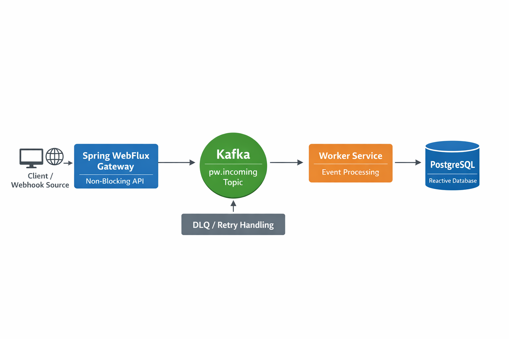

# 🌉 PonteWire: High-Performance Reactive Webhook Bridge


# PonteWire: Reactive Event-Driven Webhook Bridge

PonteWire is an event-driven backend project designed to decouple webhook ingestion from downstream processing.

It uses Spring WebFlux for non-blocking ingestion, Apache Kafka as a durable buffer, and R2DBC with PostgreSQL for reactive persistence.

The current focus is on resilience under load, failure isolation with DLQ/retries, and a clean service boundary between ingestion and processing.
 
---

## 🏗 Architecture

The system follows a decoupled, reactive microservices pattern to ensure **Zero Data Loss** even during massive traffic spikes.



### Core Components:
* **Spring WebFlux Gateway**: A non-blocking entry point that validates and normalizes incoming events.
* **Apache Kafka (KRaft)**: Acts as a high-throughput message broker and reliable persistence buffer.
* **Worker Service**: An asynchronous consumer that processes events and persists them to a reactive database.
* **Resilience Layer**: Global error handling featuring **Dead Letter Queues (DLQ)** and smart retry policies.

---

## 🚀 Key Features

| Feature | Description |
| :--- | :--- |
| **Zero-Loss Policy** | Advanced error handling with DLQ and smart retry mechanisms using `DeadLetterPublishingRecoverer`. |
| **Reactive Pipeline** | Fully non-blocking I/O from ingestion (WebFlux) to persistence (R2DBC). |
| **Architectural Contracts** | Shared DTOs and validation rules (Java 25 Records) to ensure consistency. |
| **Optimized Persistence** | Native **PostgreSQL JSONB** storage with **GIN indexing** for sub-millisecond querying. |

---

## 🛠 Tech Stack

* **Runtime:** Java 25 (Immutable Records & Pattern Matching)
* **Framework:** Spring Boot 4.0.3 (Reactive Stack)
* **Messaging:** Apache Kafka 4.2.0 (KRaft mode, No Zookeeper)
* **Persistence:** PostgreSQL 17 + R2DBC (Reactive Driver)
* **Build Tool:** Maven 3.9+

---

## 📦 Project Structure

* `pw-common`: Shared architectural contracts and utility DTOs.
* `pw-gateway`: High-throughput ingestion service (Kafka Producer).
* `pw-worker`: Event processing and auditing service (Kafka Consumer).

---

## 🚦 Getting Started

### Prerequisites
* **Docker & Docker Compose**
* **JDK 25**


## 🗺 Roadmap & Future Evolution

The development of **PonteWire** is divided into strategic milestones to reach production-grade maturity.

### 🛡 Milestone 1: Security & Integrity (In Progress)
- [x] **Core Reactive Pipeline**: End-to-end non-blocking flow.
- [x] **Dead Letter Queue**: Automated error isolation.
- [x] **HMAC Validation**: Implementing $HMAC_{SHA256}$ signature verification for incoming webhooks (e.g., Stripe, Shopify).
- [x] **HMAC Test Coverage**: Unit tests (`HmacValidationFilterTest`) and WebFlux slice tests (`HmacValidationFilterWebTest`).
- [ ] **Secrets Management**: Integration with HashiCorp Vault or AWS Secrets Manager.

### 📊 Milestone 2: Observability & Performance
- [ ] **Metrics Ingestion**: Exporting custom metrics via Micrometer to **Prometheus**.
- [ ] **Visual Dashboards**: Pre-configured **Grafana** boards for throughput and error rates tracking.
- [ ] **Distributed Tracing**: Integration with **OpenTelemetry** and Jaeger to trace events across services.

### ⚙️ Milestone 3: Traffic Control & Scaling
- [ ] **Rate Limiting**: Tenant-based throttling using **Redis** to prevent target system exhaustion.
- [ ] **Dynamic Routing**: Logic to route events to different target systems based on payload metadata.
- [ ] **Kubernetes Readiness**: Helm charts and K8s manifests for automated scaling and self-healing.

### 🧪 Milestone 4: Advanced Testing
- [ ] **Testcontainers**: Comprehensive integration tests for Kafka and PostgreSQL.
- [ ] **Chaos Engineering**: Simulating network partitions to test system resilience.

### Quick Start
```bash
# Clone the repository
git clone https://github.com/zeld1n/ponte-wire.git
# Start the infrastructure (Kafka, Postgres)
docker compose up -d

# Build and run the services
mvn clean install
```
