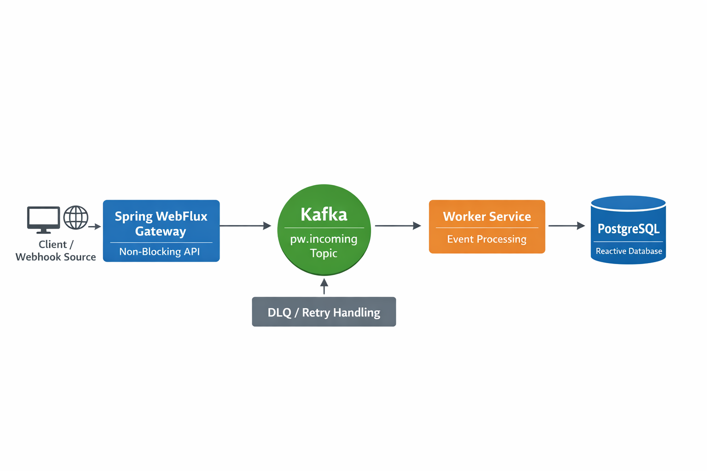

# 🌉 PonteWire: High-Performance Reactive Webhook Bridge


PonteWire is an event-driven backend designed to decouple webhook ingestion from downstream processing.

It uses Spring WebFlux for non-blocking ingestion, Apache Kafka as a durable buffer, and R2DBC with PostgreSQL for reactive persistence.

The current focus is on resilience under load, failure isolation with DLQ/retries, distributed observability, and a clean service boundary between ingestion and processing.

---

## 🏗 Architecture

The system follows a decoupled, reactive microservices pattern to ensure **Zero Data Loss** even during massive traffic spikes.



### Core Components

| Component | Technology | Role |
|-----------|-----------|------|
| **Gateway** | Spring WebFlux | Non-blocking ingestion, HMAC validation, rate limiting |
| **Broker** | Apache Kafka 3.7.x KRaft | High-throughput durable message buffer|
| **Worker** | Spring Kafka + R2DBC | Async consumer, reactive persistence |
| **Tracing** | OpenTelemetry + Jaeger | End-to-end trace propagation across services |
| **Metrics** | Micrometer + Prometheus + Grafana | Real-time observability dashboards |
| **Cache** | Redis | Tenant-based rate limiting |

---

## 🚀 Key Features

| Feature | Description |
|:--------|:-----------|
| **Zero-Loss Policy** | DLQ + smart retry via `DeadLetterPublishingRecoverer` |
| **Reactive Pipeline** | Fully non-blocking I/O: WebFlux → Kafka → R2DBC |
| **HMAC Validation** | SHA-256 signature verification per request |
| **Distributed Tracing** | W3C `traceparent` propagated from HTTP → Kafka headers → Worker |
| **Rate Limiting** | Redis-backed tenant throttling |
| **Dynamic Routing** | Payload-based routing to different Kafka topics |
| **Kubernetes Ready** | Helm charts and K8s manifests included |

---

## 🛠 Tech Stack

| Layer | Technology |
|-------|-----------|
| Runtime | Java 21 LTS (GraalVM 21.0.7) |
| Framework | Spring Boot 3.3.6 LTS (Reactive Stack) |
| Messaging | Apache Kafka 3.7.1 KRaft (no ZooKeeper) |
| Persistence | PostgreSQL 16 + R2DBC |
| Tracing | Micrometer Tracing + OTel bridge + Jaeger 1.57 |
| Metrics | Micrometer + Prometheus + Grafana |
| Cache | Redis 7 |
| Build | Maven 3.9+ |

---

## 📊 Observability

### Distributed Tracing (OpenTelemetry + Jaeger)

Every webhook request is traced end-to-end across all services under a single `traceId`:

```
HTTP POST /webhook/stripe
    │
    ▼  [SERVER span — pw-gateway]          4.38ms
    HMAC Validation → Rate Limiter → Kafka publish
    │
    ▼  [PRODUCER span — pw-gateway]        2.28ms
    Kafka: pw.incoming.stripe
    │  traceparent header injected automatically
    ▼  [CONSUMER span — pw-worker]         1.75ms
    EventProcessor → PostgreSQL R2DBC

Services: 2  ·  Depth: 3  ·  Total Spans: 3  ·  Trace duration: 7.01ms
```

---

## ⚡ Load Test Results

Tests performed on a local MacBook (Apple M-series, 8 cores) with full stack running.

### Gateway throughput (HMAC + Rate Limiter, before Kafka)

| Requests | Concurrency | RPS | P99 | Errors |
|----------|-------------|-----|-----|--------|
| 500,000 | 1,000 | ~30,000 | <200ms | 0 |

### Full end-to-end pipeline (HMAC → Kafka → Worker → PostgreSQL)

| Requests | Concurrency | RPS | P99 | Errors |
|----------|-------------|-----|-----|--------|
| 100,000 | 500 | 3,099 | 471ms | **0** |
| 500,000 | 1,000 | ~3,300 | ~500ms | **0** |

> 604,000+ messages processed. Kafka LAG = 0 throughout. Zero data loss.

---

## 📦 Project Structure

```
ponte-wire/
├── pw-common/      # Shared DTOs and architectural contracts
├── pw-gateway/     # High-throughput ingestion service (Kafka Producer)
├── pw-worker/      # Event processing service (Kafka Consumer)
├── helm/           # Kubernetes Helm charts
├── docker-compose.yml
└── prometheus.yml
```

---

## 🚦 Getting Started

### Prerequisites

- Docker & Docker Compose
- JDK 21 LTS

### Run locally

```bash
# Clone
git clone https://github.com/zeld1n/ponte-wire.git
cd ponte-wire

# Start infrastructure (Kafka KRaft, PostgreSQL, Jaeger, Prometheus, Grafana, Redis)
docker compose up -d

# Build
mvn clean package -DskipTests

# Terminal 1 — Gateway
cd pw-gateway && mvn spring-boot:run

# Terminal 2 — Worker
cd pw-worker && mvn spring-boot:run
```

### Service URLs

| Service | URL |
|---------|-----|
| Gateway API | http://localhost:8080 |
| Jaeger UI | http://localhost:16686 |
| Grafana | http://localhost:3000 |
| Prometheus | http://localhost:9090 |

### Send a test webhook

```bash
BODY='{"event":"payment.succeeded","amount":100}'
SECRET="local-dev-secret"
SIGNATURE=$(echo -n "$BODY" | openssl dgst -sha256 -hmac "$SECRET" | awk '{print "sha256="$2}')

curl -X POST http://localhost:8080/webhook/stripe \
  -H "Content-Type: application/json" \
  -H "X-Signature-SHA256: $SIGNATURE" \
  -d "$BODY"
```

---

## 🗺 Roadmap

### ✅ Milestone 1 — Security & Integrity
- [x] Core reactive pipeline: WebFlux → Kafka → R2DBC
- [x] Dead Letter Queue with automated error isolation
- [x] HMAC-SHA256 signature verification per tenant
- [x] Unit tests + WebFlux slice test coverage

### ✅ Milestone 2 — Observability & Performance
- [x] Micrometer metrics → Prometheus → Grafana dashboards
- [x] Distributed tracing — OpenTelemetry + Jaeger
- [x] Reactive context propagation (`Hooks.enableAutomaticContextPropagation`)
- [x] W3C `traceparent` propagated through Kafka message headers
- [x] Load tested: **~3,300 RPS end-to-end · 500k requests · 0 errors · LAG=0**

### ✅ Milestone 3 — Traffic Control & Scaling
- [x] Rate limiting (Redis, tenant-based)
- [x] Dynamic routing by payload metadata
- [x] Kubernetes Helm charts and K8s manifests

### 🔲 Milestone 4 — Advanced Testing
- [ ] Testcontainers integration tests for Kafka and PostgreSQL
- [ ] Chaos engineering — network partition simulation (Toxiproxy)

### 🔲 Milestone 5 — Idempotency & Deduplication
- [ ] Idempotency key extraction from header or payload hash
- [ ] Redis TTL store to detect and discard duplicate deliveries
- [ ] Metrics: `pontewire.duplicates.detected`

### 🔲 Milestone 6 — Transactional Outbox Pattern
- [ ] `outbox_events` table in PostgreSQL
- [ ] Atomic transaction: persist event + write to outbox in a single commit
- [ ] Outbox poller publishes to Kafka and marks entries as delivered
- [ ] Eliminates dual-write problem between DB and Kafka